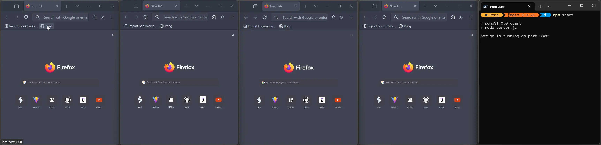

### 👋 **I am Erhan ERTEM**

&emsp;

## Udemy Complete NodeJS Developer (GraphQL, MongoDB, + more) Andrei Neagoie

### **Objective:** Create a MultiPlayer Pong Game

- Create Pong Game Frontend with websockets (Socket.io)

&emsp;

###### ⚠️Free-tier render services may get throttled leading delayed app loading 
#### [Pong Game](https://game-pong-erhan-ertem.onrender.com)

Rewritten the entire pong game code aside from how it was implemented in the tutorial as more than dual game play had serious problems and logic failures.  
- Implement a namespace/rooms configuration with socket.io
- The socket.io server can handle multiple playrooms. 
- The core game parameters kept sync in client and server-side.
- Dynamic room play parameters kept on the client side
- Added backend socket disconnect event which can re-use abondoned rooms to avoid room naming clashes, or issue players to awaiting rooms thru server-side state management.
- Disconnect of an opponent triggers display of Intro Screen and dials the room into awaiting list till another opponent jumps in.
- Keep track of global current player count
- ⚠️ PENDING ISSUE: Keep persistent session IDs to make game state logic resilient to browser refresh on client-side  
- ⚠️ PENDING ISSUE: Create a webpack setup to bundle front-end and back-end  

---

